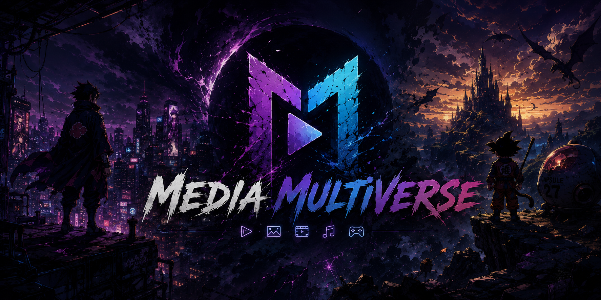
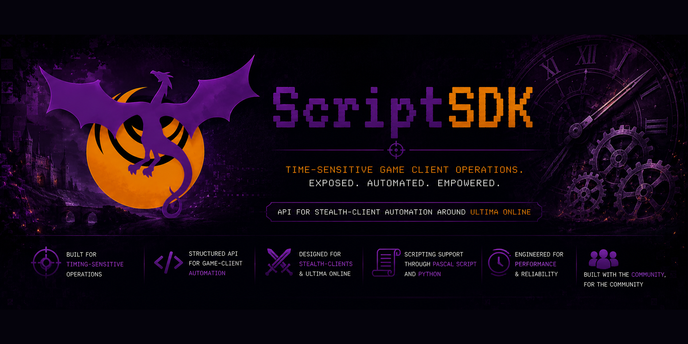
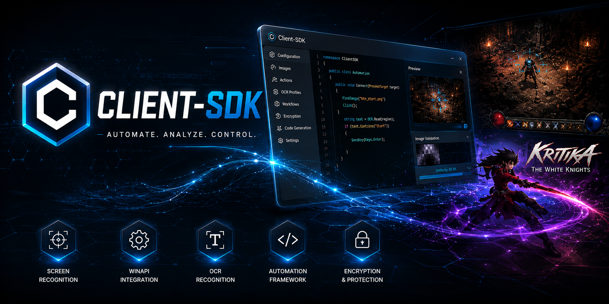
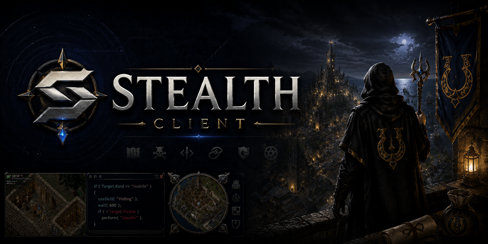

# Jan / Crome696

### Tech Lead &bull; Software Engineer &bull; AI Enthusiast

I build reliable software, enable teams, and turn messy ideas into maintainable systems.

[Portfolio](https://crome696.github.io/) &middot; [Projects](https://crome696.github.io/projects) &middot; [Stack](https://crome696.github.io/stack)

## Focus

- Technical leadership in international financial services
- Pragmatic software architecture and maintainable systems
- AI-assisted engineering, automation, and product discovery
- Full-stack delivery across backend, frontend, scripting, desktop, and automation ecosystems

## Tech Stack

## Project Timeline

<table>
  <tr>
    <td width="120"><strong>Since 2024</strong></td>
    <td width="220">
      
    </td>
    <td>
      <strong><a href="https://crome696.github.io/projects/mediamultiverse">MediaMultiVerse</a></strong> 
      Private media archiving platform with Angular, Spring Boot, OpenAPI contracts, Docker, and browser automation.
    </td>
  </tr>
  <tr>
    <td width="120"><strong>2015 to 2022</strong></td>
    <td width="220">
      
    </td>
    <td>
      <strong><a href="https://crome696.github.io/projects/scriptsdk">ScriptSDK</a></strong> 
      External API design around Stealth Client automation, later modernized with Java 17 and Spring Boot.
    </td>
  </tr>
  <tr>
    <td width="120"><strong>2015 to 2022</strong></td>
    <td width="220">
      
    </td>
    <td>
      <strong><a href="https://crome696.github.io/projects/client-sdk">Client-SDK</a></strong> 
      Research into Windows application control through WinAPI, OCR, image validation, and supporting tools.
    </td>
  </tr>
  <tr>
    <td width="120"><strong>2014 to 2017</strong></td>
    <td width="220">
      
    </td>
    <td>
      <strong><a href="https://crome696.github.io/projects/rebirthuo">RebirthUO</a></strong> 
      Live shard operations, community responsibility, and custom Ultima Online gameplay systems.
    </td>
  </tr>
  <tr>
    <td width="120"><strong>2010 to 2022</strong></td>
    <td width="220">
      
    </td>
    <td>
      <strong><a href="https://crome696.github.io/projects/stealth-client">Stealth Client</a></strong> 
      Long-running usage, testing, development, and support around Ultima Online scripting.
    </td>
  </tr>
</table>

## Engineering Mindset

Good engineering is clarity work: shaping systems, teams, decisions, and code so the next step becomes easier.

I care about product value, shared ownership, thoughtful automation, and software that survives contact with reality.
